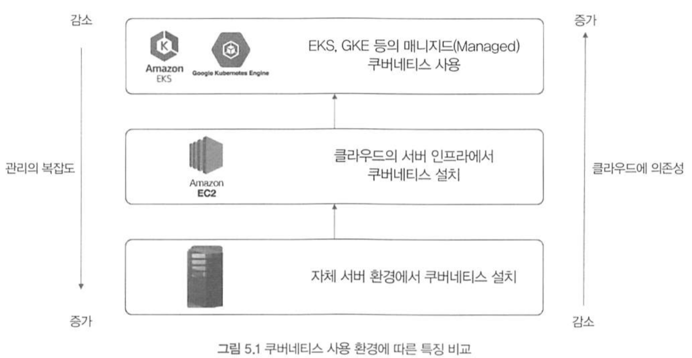
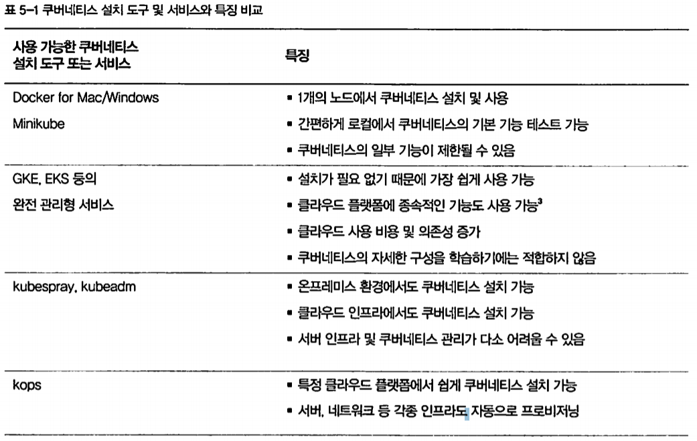

# Types and Versions of Kubernetes Installation Environments

## 쿠버네티스 설치 환경의 종류
- 도커 엔진과 달리 쿠버네티스는 사용 환경과 목적에 따라 설치하는 방법이 매우 다양하고 복잡하다.
- 개발 용도로 로컬에서 사용하려면 별도의 어려움 없이 쉽게 설치할 수도 있지만, 실제 운영 단계의 쿠버네티스 클러스터를 구축하기 위해서는 AWS, GKE(Google Kubernetes Engine) 등의 클라우드 환경에서 수십 개의 서버에 동시에 쿠버네티스를 설치해야 할 수도 있다.
- 이러한 용도에 따라 쿠버네티스 설치 툴의 종류를 대략적으로 나눠 보면 다음과 같이 구분할 수 있다.

| 개발 용도의 쿠버네티스 설치 | 서비스 테스트 or 운영 용도의 쿠버네티스 설치 |
|----------|----------|
| Minikube | kops, kubespray, kubeadm  |
|Docker Desktop for Mac/Windows에 내장된 쿠버네티스|EKS, GKE 등의 Managed 서비스|

- 개발 용도의 쿠버네티스는 손쉽게 설치할 수 있지만, 이러한 개발 용도의 쿠버네티스는 로컬 노드를 standalone 모드로 사용하기 때문에 쿠버네티스의 기능들을 완벽하게 사용해보기에는 적합하지 않다는 단점이 있다.
- 여러 서버의 자원을 클러스터링해 컨테이너를 배치하는 것이 쿠버네티스의 핵심 기능이지만, 1개의 노드로는 이러한 핵심 기능을 확인해 볼 수가 없기 때문이다.

> 따라서 Docker Desktop for Mac/Windows와 Minikube의 쿠버네티스는 간단히 설치할 수 있지만, 기본 기능의 테스트 및
> 로컬 개발 용도로 제한된다는 한계점이 있다.

- 개발 용도가 아닌, 실제 서비스 테스트 또는 운영 용도로 쿠버네티스를 사용하려면 어떠한 환경에서 쿠버네티스를 설치할 것인지를 먼저 결정해야 한다.
- 쿠버네티스의 사용 환경은 세 가지 종류로 나뉜다.
    1. 자체 서버 환경에서 쿠버네티스 설치
        - on-premise에서 쿠버네티스를 설치해 사용하기로 결정했다면 쿠버네티스를 포함한 모든 인프라를 직접 관리해야 한다.
        - 쿠버네티스와 서버 인프라를 세밀한 부분까지 설정해 원하는 대로 구성할 수 있는 것이 장점
        - 반대로 모든 관리를 직접 도맡아 해야 하므로 운영 및 유지보수가 복잡해질 수도 있다는 것이 단점
        - 자체 서버 환경에서는 kubespray, kubeadm 등의 도구를 이용해 쿠버네티스 설치 가능
    2. 클라우드 플랫폼에서 쿠버네티스 설치
        - 서버 인스턴스만을 사용해 쿠버네티스를 설치할지, 쿠버네티스 자체를 서비스로서 제공하는 매니지드 서비스를 사용할지 선택해야 함
        - 서버 인스턴스만을 사용해 쿠버네티스를 설치할 때는 서버, 네트워크 등 인프라에 대한 관리는 AWS, GCP와 같은 Cloud Provider에게 맡기되, 쿠버네티스의 설치 및 관리를 직접 수행해야 함
        - 가장 쉽게 생각해볼 수 있는 예시는 AWS의 EC2 인스턴스에 쿠버네티스를 설치하는 방법
        - 사용할 수 있는 설치 도구 : kubespray, kubeadm, kops 등
    3. 자체적으로 보유한 on-premise 서버 환경
        - AWS의 EKS(Elastic Kubernetes Service), GCP의 GKE(Google Kubernetes Engine) 등의 매니지드 서비스를 이용
        - 쿠버네티스의 설치 및 관리까지 Cloud Provider가 담당하므로 쿠버네티스 관리 및 유지보수의 비용이 줄어들게 된다.
        - 별도의 쿠버네티스를 설치할 필요 없이 실제 서비스 환경 구성 가능
        - 하지만 시작하는 단계에서는 곧바로 매니지드 서비스를 이용하기보다는 직접 쿠버네티스를 설치해 전체적인 개념 파악이 중요

- 위의 내용을 간단하게 정리해보면 다음과 같다.

> 쿠버네티스는 클라우드 플랫폼에서만 사용할 수 있는 기능이 일부 포함돼 있다. 따라서 로컬 개발 환경이나 온프레미스 서버에서 쿠버네티스를 설치해 사용할 경우 LoadBalancer 또는 Persistent Volume 등의 기능을 사용하지 못할 수 있다. 이러한 기능들은 kops(AWS) 또는 GKE를 이용해 생성한 쿠버네티스를 기준으로 설명한다.

## 쿠버네티스 버전 선택
- 어떤 환경에서 쿠버네티스를 설치할 것인지 결정했다면, 다음은 어떤 버전의 쿠버네티스를 설치할 것인지 생각해 볼 차례이다.
- 어떠한 버전의 쿠버네티스를 설치해도 핵심 개념은 같기 때문에 사용 방법을 익히는 데에는 크게 문제가 없지만, 쿠버네티스의 기능이 매우 빠르게 업데이트 되기 때문에 사소한 버전 차이로 인해 쿠버네티스의 사용 방법이나 기능이 달라질 수도 있다.
- 따라서 운영 단계의 쿠버네티스를 고려한다면 쿠버네티스의 버전을 신중이 선택해야 한다.

> 지금은 쿠버네티스의 기능을 실제로 사용해본 뒤, 요구 사항에 적합한 버전을 적절히 선택해야 한다. 여기서는 쿠버네티스 버전 1.23을 기준으로 설명하지만, 내 Desktop for Mac의 버전은 1.29.2 이므로 버전 차이를 잘 극복해 보겠다..!