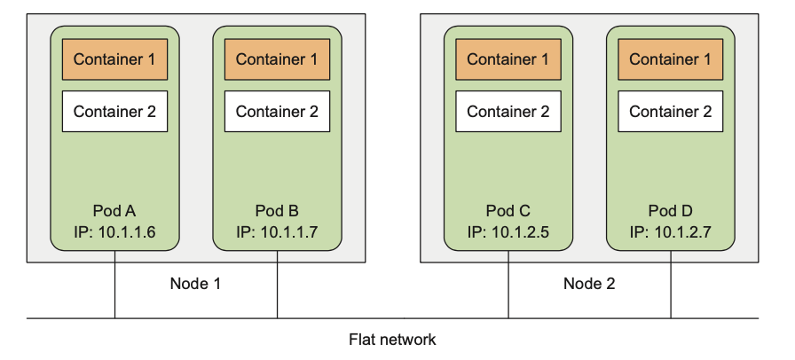

# 파드(Pod) : 컨테이너를 다루는 기본 단위

- 쿠버네티스에는 셀 수 없을 만큼 많은 리소스 종류와 컴포넌트가 존재한다.
- 그중에서 컨테이너 애플리케이션을 구동하기 위해 `반드시 알아야 할 몇 가지 오브젝트가 있다.`
- 그것은 바로 `Pod, Replica Set, Service, Deployment`이며 이번에는 파드를 배워보겠다.


## 파드 사용하기
- 쿠버네티스에서 컨테이너 애플리케이션의 기본 단위를 `Pod`라고 하며, `파드는 1개 이상의 컨테이너로 구성된 컨테이너의 집합`이다.
- 도커 엔진에서는 기본 단위가 도커 컨테이너였고, 스웜 모드에서의 기본 단위는 여러 개의 컨테이너로 구성된 service였다.
- 이와 비슷한 맥락으로 쿠버네티스에서는 컨테이너 애플리케이션을 배포하기 위한 기본 단위로 파드라는 개념을 사용한다.
- 간단한 예시로, Nginx 웹 서비스를 쿠버네티스에서 생성하고 싶다면 파드 1개에 Nginx 컨테이너 1개만을 포함해 생성하는 것이다.
- 만약 동일한 Nginx 컨테이너를 여러 개 생성하고 싶으면 1개의 Nginx 컨테이너가 들어 있는 동일한 파드를 여러 개 생성하면 된다.

> 이처럼 파드는 컨테이너 애플리케이션을 나타내기 위한 기본 구성 요소가 된다.

<br>

- 파드의 개념을 좀 더 정확히 이해하기 위해 Nginx 컨테이너로 구성된 파드를 직접 생성해보자.
- 다음 내용을 nginx-pod.yaml로 작성한다.

```yaml
apiVersion: v1
kind: Pod
metadata:
  name: my-nginx-pod
spec:
  containers:
  - name: my-nginx-container
    image: nginx:latest
    ports:
    - containerPort: 80
      protocol: TCP
```

- `apiVersion`
    - YAML 파일에서 정의한 오브젝트의 API 버전을 나타냄
    - 지금 당장은 크게 중요하지 않으며, 오브젝트의 종류 및 개발 성숙도에 따라 apiVersion의 설정값이 달라질 수 있다.
- `kind`
    - 리소스의 종류를 나타냄
    - 생성하려고 하는 것이 파드이기 때문에 Pod를 입력
    - kind에서 사용하는 리소스 오브젝트 종류는 `kubectl api-resources` 명령어의 KIND 항목을 통해 확인할 수 있다.
- `metadata`
    - 라벨, 주석(Annotation), 이름 등과 같은 리소스의 부가 정보들을 입력
    - 위 예시에서는 name 항목에서 파드의 고유한 이름을 my-nginx-pod로 설정
- `spec`
    - 리소스를 생성하기 위한 자세한 정보 입력
    - 위 예시에서는 파드에서 실행될 컨테이너 정보를 정의하는 `containers`항목을 작성한 뒤, 하위 항목인 `image`에서 사용할 도커 이미지를 지정했다.
    - `name`항목에서는 컨테이너의 이름을, ports 항목에서는 Nginx 컨테이너가 사용할 포트인 80번을 입력했다.

- 작성한 YAML 파일은 `kubectl apply -f` 명령어로 쿠버네티스에 생성할 수 있으며, `kubectl get <오브젝트 이름>`을 사용하면 특정 오브젝트의 목록을 확인할 수 있다.
    ```bash
    $ kubectl apply -f nginx-pod.yaml
    pod/my-nginx-pod created

    $ kubectl get pods
    NAME           READY   STATUS              RESTARTS   AGE
    my-nginx-pod   0/1     ContainerCreating   0          6s
    ``` 
- 이 Nginx 파드를 생성할 떄, YAML 파일에 사용할 포트(containerPort)를 정의하긴 했지만, 아직 외부에서 접근할 수 있도록 노출된 상태는 아니다.
> 따라서 파드의 Nginx 서버로 요청을 보내려면 파드 컨테이너 내부 IP로 접근해야 한다.

<br>

- `kubectl describe` 명령어를 사용하면 생성된 리소스의 자세한 정보를 얻어올 수 있다.
- 예를 들어, 파드의 자세한 정보를 보고 싶다면 `kubectl describe pods <파드 이름>`처럼 명령어를 사용한다.
    ```
    $ kubectl describe pods my-nginx-pod
    Name:             my-nginx-pod
    Namespace:        default
    Priority:         0
    Service Account:  default
    Node:             docker-desktop/192.168.65.3
    Start Time:       Fri, 09 Aug 2024 16:09:47 +0900
    Labels:           <none>
    Annotations:      <none>
    Status:           Running
    IP:               10.1.0.14
    IPs:
    IP:  10.1.0.14
    Containers:
    my-nginx-container:
        Container ID:   docker://207be6c7a873ebb07dbae789f741ad9b5cfce9fb23826721a1f9bbae007f68ba
        Image:          nginx:latest
        Image ID:       docker-pullable://nginx@sha256:6af79ae5de407283dcea8b00d5c37ace95441fd58a8b1d2aa1ed93f5511bb18c
        Port:           80/TCP
        Host Port:      0/TCP
        State:          Running
        Started:      Fri, 09 Aug 2024 16:09:54 +0900
        Ready:          True
        Restart Count:  0
        Environment:    <none>
        Mounts:
        /var/run/secrets/kubernetes.io/serviceaccount from kube-api-access-vfcc9 (ro)

    ...
    ```
- 위처럼 Nginx 파드에 대한 많은 정보를 출력할 수 있으며, 그중 파드의 IP 항목도 포함돼 있다.
- 출력 결과에서 알 수 있듯이 파드의 IP는 `10.1.0.14` 이다.
- 그러나 앞서 말했던 것처럼 이 IP는 외부에서 접근할 수 있는 IP가 아니기 때문에 클러스터 내부에서만 접근 가능하다.

> docker run 명령어에서 -p 옵션 없이 컨테이너를 실행한 것과 비슷하다고 생각하면 된다.

<br>

- 쿠버네티스 외부 또는 내부에서 파드에 접근하려면 `service`라고 하는 쿠버네티스 오브젝트를 따로 생성해야 하지만, 지금은 서비스 오브젝트 없이 IP만으로 Nginx 파드에 접근해 보겠다.
- 클러스터의 노드 중 하나에 접속한 뒤 다음과 같이 Nginx 파드의 IP로 HTTP 요청을 전송한다.
    ```
    $ curl 10.1.0.14
    ```
- 만약, 클러스터의 노드로 접속하는 것이 여의치 않은 상황이면 다음 명령어를 통해 클러스터 내부에 테스트용 파드를 생성해 임시로 사용할 수 있다.
    ```
    $ kubectl run -i --tty --rm --image=alicek106/ubuntu:curl --restart=Never debug -- /bin/bash

    If you don't see a command prompt, try pressing enter.

    $ root@debug:/#
    $ root@debug:/# ls
    bin  boot  dev  etc  home  lib  lib64  media  mnt  opt  proc  root  run  sbin  srv  sys  tmp  usr  var
    root@debug:/# curl 10.1.0.14
    <!DOCTYPE html>
    <html>
    <head>
    <title>Welcome to nginx!</title>
    <style>
    html { color-scheme: light dark; }
    body { width: 35em; margin: 0 auto;
    font-family: Tahoma, Verdana, Arial, sans-serif; }
    </style>
    </head>
    <body>
    <h1>Welcome to nginx!</h1>
    <p>If you see this page, the nginx web server is successfully installed and
    working. Further configuration is required.</p>

    <p>For online documentation and support please refer to
    <a href="http://nginx.org/">nginx.org</a>.<br/>
    Commercial support is available at
    <a href="http://nginx.com/">nginx.com</a>.</p>

    <p><em>Thank you for using nginx.</em></p>
    </body>
    </html>
    ```

<br>

- 이번엔 파드 컨테이너 내부로 직접 들어가 보겠다.
- `docker exec`와 비슷하게 쿠버네티스에도 `kubectl exec` 명령어로 파드의 컨테이너에 명령어를 전달할 수 있다.
- 예를 들어, my-nginx-pod에서 bash 쉘을 실행하되, -it 옵션으로 쉘을 유지할 수 있다.
    ```
    kubectl exec -it my-nginx-pod bash
    ```

<br>

- 도커에서 `docker logs` 명령어를 사용했던 것처럼 쿠버네티스에서도 `kubectl logs` 명령어로 파드의 로그를 확인할 수 있다.
- 다음 명령어를 사용하면 Nginx 파드의 표준 출력 로그를 확인할 수 있다.
    ```
    kubectl logs my-nginx-pod
    ```

<br>

- 쿠버네티스의 오브젝트는 kubectl delete -f 명령어로 쉽게 삭제할 수 있다.
- 다음 명령어는 nginx-pod.yaml에 정의된 Nginx 파드를 삭제한다.
```
kubectl delete -f nginx-pod.yaml

# 또는

kubeclt delete pod <파드 이름>
```


## 파드 vs 도커 컨테이너
- 위의 기능들만 보면 파드는 `docker run`으로 생성한 단일 nginx 컨테이너와 크게 다르지 않아 보인다.
- 왜냐하면 파드는 컨테이너 IP 주소를 가지고 있어 쿠버네티스 클러스터 내부에서 접근할 수 있고, `kubectl exec` 명령어로 파드 컨테이너 내부로 들어갈 수도 있으며, `kubectl logs` 명령어로 파드의 로그를 확인할 수도 있기 때문이다.
- 그렇다면 쿠버네티스는 '도커 컨테이너'가 아니라 왜 굳이 '파드'라는 새로운 개념을 사용할까??


### 파드라는 개념을 사용하는 예시

- 쿠버네티스가 파드를 사용하는 이유는 컨테이너 런타임의 인터페이스 제공 등 여러 가지가 있지만, 그 이유 중 하나는 여러 리눅스 네임스페이스(namespace)를 공유하는 여러 컨테이너들을 추상화된 집합으로 사용하기 위해서이다.

> 좀 더 쉽게 이해할 수 있게 파드를 사용하는 예시를 하나 더 보자.
- `kubectl get pods` 명령어로 파드의 목록을 출력했을 떄, READY 항목에서 1/1이라는 출력을 봤을 것이다.
- Nginx 파드에는 1개의 컨테이너가 정의돼 있으며, 이 컨테이너는 정상적으로 준비됐다는 뜻이다.
    ```
    $ kubectl get pod
    NAME           READY   STATUS    RESTARTS   AGE
    my-nginx-pod   1/1     Running   0          23s
    ```
- 실제로 대부분 쿠버네티스의 컨테이너 애플리케이션은 이처럼 1개의 컨테이너로 파드를 구성해 사용하지만, `1/1`이라는 항목에서 알 수 있듯이 파드는 반드시 1개의 컨테이너로 구성해야 하는 것은 아니다.
> 다시 말하면 READY 항목은 파드의 컨테이너 개수에 따라 2/2도 될 수 있고, 3/3도 될 수 있다.

- 그렇다면 이번에는 Nginx 파드에 새로운 우분투 컨테이너를 추가해 보겠다.
- 이전에 사용한 YAML 파일을 확장해 아래 내용으로 새로운 YAML 파일을 작성한다.
    ```yaml
    apiVersion: v1
    kind: Pod
    metadata:
    name: my-nginx-pod
    spec:
    containers:
    - name: my-nginx-container
        images: nginx:latest
        ports:
        - containerPort: 80
        protocol: TCP

    - name: ubuntu-sidecar-container
        image: alicek106:rr-test:curl
        command: ["tail"]
        args: ["-f", "/dev/null"]  # 컨테이너가 종료되지 않도록 유지
    ```
    - curl이 미리 설치된 우분투 이미지인 'alicek106:rr-test:curl'을 사용했다.
    - 이 컨테이너가 종료되지 않기 위해 'tail -f /dev/null'이라는 단순한 동작만 실행한다.
    - `YAML에서 대시(-)를 사용하는 항목은 여러 개의 항목을 정의할 수 있다.`
    - 따라서 이번에는 파드에 우분투 컨테이너를 하나 더 추가한 것이다.

> 파드의 YAML 파일에서 사용되는 command와 args는 컨테이너 내부에서 가장 먼저 실행될 프로세스를 지정한다. YAML 파일에서의
> command는 도커 컨테이너의 Entrypoint와 동일하고, 파드에서의 args는 도커 컨테이너의 Cmd(커맨드)와 동일하다고 이해하면 쉽다.

> 참고로 도커에서 Entrypoint와 CMD를 함께 사용할 떄, Entrypoint는 실행할 명령을 설정하고, CMD는 해당 명령에 전달될 기본 매개변수를 제공하는 식으로 사용한다.

- 앞서 파드를 생성했던 것처럼 `kubectl apply -f` 명령을 사용해 YAML 파일을 쿠버네티스에 적용하고, 시간이 지나면 Nginx 파드에 2개의 컨테이너가 실행 중인 것을 확인할 수 있다.
    ```
    $ kubectl get pods
    NAME           READY   STATUS    RESTARTS   AGE
    my-nginx-pod   2/2     Running   0          103s
    ```
- 이제 새롭게 추가된 우분투 컨테이너에 내부로 들어가 curl 명령어를 localhost로 보내볼 것이다.
    ```
    $ kubectl exec -it my-nginx-pod -c ubuntu-sidecar-container bash

    root@my-nginx-pod:/# curl localhost
    <!DOCTYPE html>
    <html>
    <head>
    <title>Welcome to nginx!</title>
    <style>
    html { color-scheme: light dark; }
    body { width: 35em; margin: 0 auto;
    font-family: Tahoma, Verdana, Arial, sans-serif; }
    </style>
    </head>
    <body>
    <h1>Welcome to nginx!</h1>
    <p>If you see this page, the nginx web server is successfully installed and
    working. Further configuration is required.</p>

    <p>For online documentation and support please refer to
    <a href="http://nginx.org/">nginx.org</a>.<br/>
    Commercial support is available at
    <a href="http://nginx.com/">nginx.com</a>.</p>

    <p><em>Thank you for using nginx.</em></p>
    </body>
    </html>
    ``` 
- ubuntu-sidecar-container 컨테이너 내부에서 Nginx 서버를 실행하고 있지 않는데도, 우분투 컨테이너의 로컬호스트에서 Nginx 서버로 접근이 가능한 것을 확인할 수 있다.
- 이는 파드 내의 컨테이너들이 네트워크 네임스페이스 등과 같은 리눅스 네임스페이스를 공유해 사용하기 때문이다.

> 네트워크 네임스페이스는 컨테이너의 고유한 네트워크 환경을 제공해주는 역할을 담당한다. 예를 들어 docker run 명령어로 docker0
> 브리지에 연결된 컨테이너가 생성됐다면, 그 컨테이너는 자기 자신만의 고유한 네트워크 네임스페이스를 가지게 된다. 그렇기 때문에 호스트
> 및 다른 컨테이너와 다른 고유한 IP를 유지하게 된다.

- 도커 네트워크 기능에서 `docker run --net container:(컨테이너 이름)` 옵션을 사용한다면, 네트워크 네임스페이스를 컨테이너 간에 공유해 사용할 수 있게 하여 여러 개의 컨테이너가 동일한 네트워크 환경을 가지게 된다.
- `쿠버네티스의 파드 또한 이러한 리눅스 네임스페이스의 공유 개념을 사용하게 되는 것이다.`
    

- 그러나 파드가 공유하는 리눅스 네임스페이스에 네트워크 환경만 있는 것은 아니다.
- 1개의 파드에 포함된 컨테이너들은 여러 개의 리눅스 네임스페이스를 공유한다.
- 그러나 지금은 이런 것들에 대해 자세히 알 필요가 없으며, 지금은 `파드 내부의 컨테이너들은 네트워크와 같은 리눅스 네임스페이스를 공유한다`라는 것만 알고 넘어가면 된다.


## 완전한 애플리케이션으로서의 파드
- 앞서 언급했듯이, 실제 쿠버네티스 환경에서는 1개의 컨테이너로 구성된 파드를 사용하는 경우가 많으며, 앞으로의 예시도 그럴 예정이다.
- 그렇다면 왜 하나의 파드에 여러 개의 컨테이너가 함께 포함돼야 하는지에 대해 의문점이 생길 수도 있다.
- 여기서 한 가지 유의해야 할 점은 `하나의 파드는 하나의 완전한 애플리케이션`이라는 점이다.
- Nginx 컨테이너는 그 자체만으로도 완전한 애플리케이션이기 때문에 하나의 파드에 2개의 Nginx 컨테이너가 정의되는 것은 바람직하지 않다.
- 따라서 우리가 처음에 생성했던 파드에서는 1개의 Nginx 컨테이너만을 정의했다.

### sidecar(사이드카) 컨테이너
- Nginx 컨테이너가 실행되기 위해 부가적인 기능을 필요로 할 수 있다.
- 예를 들어, Nginx의 설정 파일의 변경사항을 갱신해주는 설정 리로더(reloader) 프로세스, 로그를 수집해주는 프로세스 등, 이러한 프로세스는 Nginx 컨테이너와 함께 실행되어야 한다.
- 이런 경우 파드의 주 컨테이너를 Nginx로 설정하며, 기능 확장을 위한 추가 컨테이너를 파드에 포함시킬 수 있다.
- `이렇게 파드에 정의된 부가적인 컨테이너를 사이드카(sidecar) 컨테이너 라고 부르며, 사이드카 컨테이너는 파드 내의 다른 컨테이너와 네트워크 환경 등을 공유하게 된다.`
- 때문에 파드에 포함된 컨테이너들은 모두 같은 워커 노드에서 함께 실행된다.

> 이러한 구조 및 원리에 따라 파드에 정의된 여러 개의 컨테이너는 하나의 완전한 애플리케이션으로서 동작하게 되는 것이며, 이것이
> 도커 컨테이너와 쿠버네티스 파드의 차이점이다.


### Pause 컨테이너
- 파드의 네트워크 namespace는 Pause라는 이름의 컨테이너로부터 네트워크를 공유받아 사용한다. 
- Pause 컨테이너는 네임스페이스를 공유하기 위해 파드별로 생성되는 컨테이너이며, Pause 컨테이너는 각 파드에 대해 자동으로 생성된다. 
- `ps aux | grep pause` 명령어를 통해 확인할 수 있으며, 도커 엔진을 컨테이너 런타임으로 쓰고 있다면 `docker ps` 명령어로 pause 컨테이너를 직접 확인할 수 있다.


