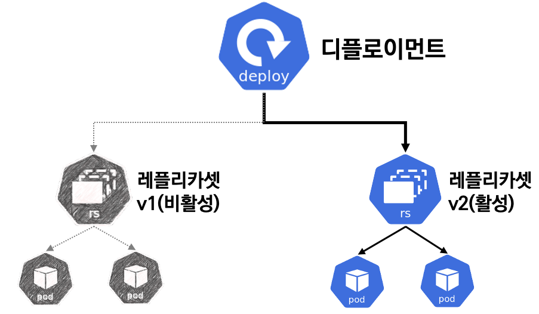

# 디플로이먼트(Deployment) : 레플리카셋, 파드의 배포를 관리

## 디플로이먼트 사용하기
- 레플리카셋만 사용해도 충분히 마이크로서비스 구조의 컨테이너를 구성할 수 있을 것 같지만, `실제로는 레플리카셋과 파드의 정보를 정의하는 Deployment`라는 오브젝트를 YAML 파일에 정의하여 사용한다.
- 디플로이먼트는 레플리카셋의 상위 오브젝트이기 때문에 디플로이먼트를 생성하면 해당 디플로이먼트에 대응하는 레플리카셋도 함께 생성된다.
- 간단한 예시를 통해 디플로이먼트를 직접 생성해보겠다.
```yaml
apiVersion: apps/v1
kind: Deployment
metadata:
  name: my-nginx-deployment
spec:
  replicas: 3
  selector:
    matchLabels:
      app: my-nginx
  template:
    metadata:
      name: my-nginx-pod
      labels:
        app: my-nginx
    spec:
      containers:
      - name: nginx
        image: nginx:1.10
        ports:
        - containerPort: 80
```
- 위의 YAML을 ReplicaSet과 비교해보자면, kind가 Deployment로 바뀐것 말고는 변경된 부분이 거의 없어 보인다.
- 이제 디플로이먼트를 생성해보자.
```
$ k apply -f deployment-nginx.yaml
deployment.apps/my-nginx-deployment created

$ k get deploy
NAME                  READY   UP-TO-DATE   AVAILABLE   AGE
my-nginx-deployment   3/3     3            3           65s

$ k get pods
NAME                                   READY   STATUS    RESTARTS   AGE
my-nginx-deployment-549567945c-88kp6   1/1     Running   0          71s
my-nginx-deployment-549567945c-q4bf8   1/1     Running   0          71s
my-nginx-deployment-549567945c-x9m8x   1/1     Running   0          71s

$ k get  rs
NAME                             DESIRED   CURRENT   READY   AGE
my-nginx-deployment-549567945c   3         3         3       2m38s
```
- 이렇게 디플로이먼트를 배포하면 관련된 레플리카셋과, 파드가 생성된 것을 볼 수 있다.
- 즉, 디플로이먼트를 생성함으로써 레플리카셋이 생성됐고, 레플리카셋이 파드를 생성한 것이다.
- 따라서 디플로이먼트를 삭제하면 레플리카셋과 파드 또한 함께 삭제된다.

> 디플로이먼트로부터 생성된 레플리카셋과 파드는 549567945c라는 특이한 해시값을 포함한 이름으로 생성됐다. 이 해시값은 파드를 정의하는 템플릿으로부터 생성된 것으로, 이 해시값에 대해서는 나중에 알아보도록 한다.


## 디플로이먼트를 사용하는 이유
- 그렇다면 쿠버네티스는 왜 레플리카셋을 그대로 사용하지 않고 굳이 상위 개념인 디플로이먼트를 다시 정의해 사용할까?
- 디플로이먼트를 사용하는 핵심적인 이유 중 하나는 애플리케이션의 업데이트와 배포를 더욱 편하게 만들기 위해서이다.
- Deployment라는 이름의 Deploy 단어의 뜻이 나타내는 것처럼 디플로이먼트는 컨테이너 애플리케이션을 배포하고 관리하는 역할을 담당한다.
- 예를 들어 애플리케이션을 업데이트할 때 레플리카셋의 변경 사항을 저장하는 revision(리비전)을 남겨 롤백을 가능하게 해주고, 무중단 서비스를 위해 파드의 롤링 업데이트 전략을 지정할 수도 있다.

<br>

- 좀 더 쉬운 이해를 위해 디플로이먼트를 이용해 애플리케이션의 버전을 업데이트 해보자.
- 이전과 동일한 YAML 파일인 deployment-nginx.yaml 파일로 디플로이먼트를 생성하되, 이번에는 `--record`라고 하는 옵션을 추가해보자.
```
$ k apply -f deployment-nginx.yaml --record
Flag --record has been deprecated, --record will be removed in the future
deployment.apps/my-nginx-deployment created

$ k get po
NAME                                   READY   STATUS        RESTARTS   AGE
my-nginx-deployment-549567945c-45dxl   1/1     Running       0          20m
my-nginx-deployment-549567945c-55k9l   1/1     Running       0          20m
my-nginx-deployment-549567945c-tvmzq   1/1     Running       0          20m
```

- 이제 컨테이너 애플리케이션의 버전이 업데이트되어 파드의 이미지를 변경해야 한다고 가정해보자.
- 이때 디플로이먼트에서 생성된 파드의 이미지를 변경할 때는 `kubectl set image` 명령어를 사용할 수 있다.
- 예를 들어 파드의 이미지 버전을 `nginx:1.11`으로 변경하려면 다음과 같은 명령어를 입력하면 된다.
```
$ kubectl set image deployment my-nginx-deployment nginx=nginx:1.11 --record
```
- `kubectl set image`외에도 2가지 방법으로 컨테이너 이미지를 변경할 수 있다.
    - YAML 파일에서 직접 image 항목을 nginx:1.11으로 수정 후, `kubectl apply -f` 명령어로 적용
    - 이전에 사용했던 `kubectl edit` 명령어를 사용


<br>

- 다시 파드의 목록을 확인해 보면 방금 전에 이미지를 업데이트함으로써 새롭게 생성된 파드들이 존재할 것이다.
```
$ k get pods
NAME                                  READY   STATUS    RESTARTS   AGE
my-nginx-deployment-6b5f4f694-c8njp   1/1     Running   0          2m38s
my-nginx-deployment-6b5f4f694-h2nlr   1/1     Running   0          2m53s
my-nginx-deployment-6b5f4f694-m4pmf   1/1     Running   0          2m46s
```
- 레플리카셋을 출력해보면 어떨까? 
```
$ k get rs
NAME                             DESIRED   CURRENT   READY   AGE
my-nginx-deployment-549567945c   0         0         0       3m6s
my-nginx-deployment-6b5f4f694    3         3         3       34s
```

- 이상하게 2가지의 레플리카셋이 있는데, 하나는 이미지가 업데이트됨에 따라 새롭게 생성된 레플리카셋이며 하나는 처음 생성되었던 레플리카셋이다.
- 디플로이먼트는 파드의 정보를 업데이트함으로써 새로운 레플리카셋과 파드를 생성했음에도 불구하고 이전 버전의 레플리카셋을 삭제하지 않고 남겨두었다.
- `즉, 디플로이먼트는 파드의 정보가 변경되어 업데이트가 발생했을 때, 이전의 정보를 리비전으로서 보존하며, 다음과 같은 명령어로 리비전 정보를 자세히 확인 가능하다.`
```
$ kubectl rollout history deployment my-nginx-deployment
deployment.apps/my-nginx-deployment
REVISION  CHANGE-CAUSE
1         kubectl apply --filename=deployment-nginx.yaml --record=true
2         kubectl set image deployment my-nginx-deployment nginx=nginx:1.11 --record=true
``` 

<br>

- `--record=true` 옵션으로 디플로이먼트를 변경하면 변경 사항을 위와 같이 디플로이먼트에 기록함으로써 해당 버전의 레플리카셋을 보존한다. 
- 참고로 `--record` 옵션을 사용하지 않아도 이전의 레플리카셋은 보존되지만, 어떤 명령어를 통해 변경됐는지 기록하는 `CHANGE-CAUSE` 항목에 `<NONE>`으로 표시된다. 
- 만약 이전 버전의 레플리카셋으로 되돌리는 롤백을 하고 싶다면 다음 명령어를 사용할 수 있으며, `--to-revision`에는 되돌리려는 리비전의 번호를 입력하면 된다.
```
$ k rollout undo deployment my-nginx-deployment --to-revision=1
deployment.apps/my-nginx-deployment rolled back

$ k get rs
NAME                             DESIRED   CURRENT   READY   AGE
my-nginx-deployment-549567945c   3         3         3       9m36s
my-nginx-deployment-6b5f4f694    0         0         0       7m4s
```

> 레플리카셋의 목록을 확인해 보면 처음에 생성했던 레플리카셋이 다시 3개의 파드를 생성하고 있는 것을 알 수 있다. 물론 방금 새롭게 생성됐던 레플리카셋의 파드 수는 0으로 줄어들었다. 그리고 `k rollout undo deployment my-nginx-deployment --to-revision=2` 명령어를 입력하면 다시 리비전 2로 되돌아 올 수 있다.

<br>

```
$ k get rs --show-labels
NAME                             DESIRED   CURRENT   READY   AGE     LABELS
my-nginx-deployment-549567945c   0         0         0       6m21s   app=my-nginx,pod-template-hash=549567945c
my-nginx-deployment-6b5f4f694    3         3         3       5m24s   app=my-nginx,pod-template-hash=6b5f4f694
```

> 파드 템플릿으로부터 계산된 해시값은 각 레플리카셋의 라벨 셀렉터(matchLabels)에서 pod-template-hash라는 이름의 라벨값으로서 자동으로 설정된다. 따라서 여러 개의 레플리카셋은 겹치지 않는 라벨을 통해 파드를 생성하게 된다.


- 쿠버네티스 리소스의 자세한 정보를 출력하는 `kubectl describe` 명령어를 사용해 디플로이먼트의 정보를 출력해 보면 현재의 레플리카셋 리비전 정보와 활성화된 레플리카셋 이름을 확인할 수 있다.
```
$ kubectl describe deploy my-nginx-deployment
Name:                   my-nginx-deployment
Namespace:              default
CreationTimestamp:      Tue, 03 Sep 2024 13:30:40 +0000
Labels:                 <none>
Annotations:            deployment.kubernetes.io/revision: 3
Selector:               app=my-nginx
Replicas:               3 desired | 3 updated | 3 total | 3 available | 0 unavailable
StrategyType:           RollingUpdate
MinReadySeconds:        0
RollingUpdateStrategy:  25% max unavailable, 25% max surge
Pod Template:
  Labels:  app=my-nginx
  Containers:
   nginx:
    Image:         nginx:1.10
    Port:          80/TCP
    Host Port:     0/TCP
    Environment:   <none>
    Mounts:        <none>
  Volumes:         <none>
  Node-Selectors:  <none>
  Tolerations:     <none>
Conditions:
  Type           Status  Reason
  ----           ------  ------
  Available      True    MinimumReplicasAvailable
  Progressing    True    NewReplicaSetAvailable
OldReplicaSets:  my-nginx-deployment-6b5f4f694 (0/0 replicas created)
NewReplicaSet:   my-nginx-deployment-549567945c (3/3 replicas created)

...
```



- `이처럼 디플로이먼트는 여러 개의 레플리카셋을 관리하기 위한 상위 오브젝트이다.`
- 디플로이먼트를 사용하면 이러한 레플리카셋의 리비전 관리뿐만 아니라 다양한 파드의 롤링 업데이트 정책을 사용할 수도 있다는 장점이 있다.
- 따라서 쿠버네티스에서도 공식적으로 디플로이먼트를 사용할 것을 권장한다.

> 디플로이먼트는 레플리카셋의 상위 수준의 오브젝트이며, 일반적으로 디플로이먼트를 통해 파드를 생성한다.