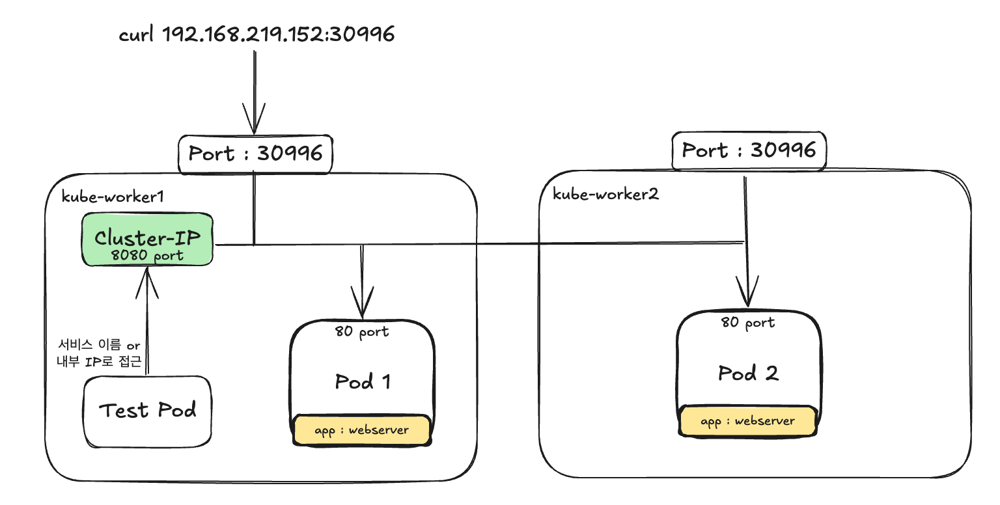
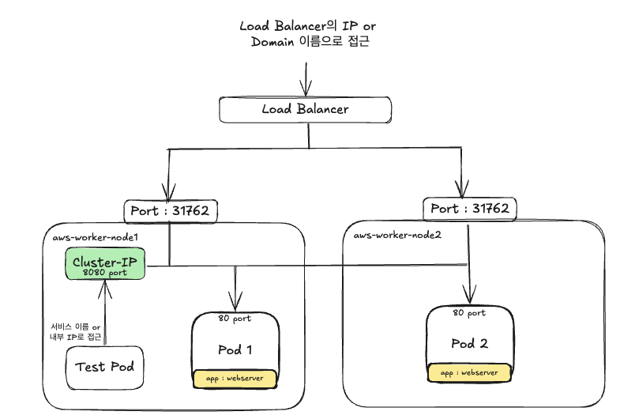

# 서비스(Service) : 파드를 연결하고 외부에 노출
- 지금까지 쿠버네티스에서 컨테이너를 구성하는 가장 중요한 요소인 파드, 레플리카셋, 그리고 디플로이먼트에 대해서 알아봤다.
- `이제 디플로이먼트를 통해 생성된 파드에 어떻게 접근할 수 있을지에 대해 알아볼 것이다.`
- 도커 컨테이너와 마찬가지로 파드의 IP는 영속적이지 않아 항상 변할수 있다.
- 따라서 여러 개의 디플로이먼트를 하나의 완벽한 애플리케이션으로 연동하려면 파드의 IP가 아닌 서로를 발견할 수 있는 다른 방법이 필요하다.
- 도커 컨테이너는 `-p(publish) 옵션`을 통해 컨테이너가 생성됨과 동시에 컨테이너를 외부에 노출시킬 수 있었으며, `오버레이 네트워크`를 통해 컨테이너들이 서로를 접근하게 할 수 있게 하였다.
```
$ docker run -d --name myapp -p 80:80 nginx:latest

$ docker network create mynetwork
$ docker run mycontainer --network mynetwork --net-alias mycon ubuntu:16.04
```

<br>

- 그렇지만 쿠버네티스에서는 파드에 접근하도록 정의하는 방법이 도커와 약간 다르며, `docker run -p 명령어와는 달리` 디플로이먼트를 생성할 떄 파드를 외부에 노출하지도 않는다.
- `단지 디플로이먼트의 YAML 파일에는 파드의 애플리케이션이 사용할 내부 포트만을 정의할 뿐이다.`
- 이전의 Nginx 디플로이먼트를 생성했을 때 사용했던 YAML 파일 중, `containerPort` 항목이 바로 내부 포트를 정의하는 것이다.
```yaml
...
      app: my-nginx
  template:
    metadata:
      name: my-nginx-pod
      labels:
        app: my-nginx
    spec:
      containers:
      - name: nginx
        image: nginx:1.10
        ports:
        - containerPort: 80
```

<br>

- 그러나 YAML 파일에서 `containerPort` 항목을 정의했다고 해서 `이 파드가 바로 외부로 노출되는 것은 아니다.`
- 이 포트를 외부로 노출해 사용자들이 접근하거나 다른 디플로이먼트의 파드들이 내부적으로 접근하려면 `Service(서비스)라는 별도의 쿠버네티스 오브젝트를 생성해야 한다.`
- 서비스는 파드에 접근하기 위한 규칙을 정의하며 `핵심 기능`은 다음과 같다.
    1. 여러 개의 파드에 쉽게 접근할 수 있도록 고유한 도메인 이름 부여
    2. 여러 개의 파드에 접근할 때, 요청을 분산하는 로드 밸런서 기능 수행
    3. 클라우드 플랫폼의 로드 밸런서, 클러스터 노드의 프토 등을 통해 파드를 외부로 노출


> 쿠버네티스를 설치할 때 기본적으로 calico, flannel 등의 네트워크 플러그인을 사용하도록 설정되기 때문에 자동으로 오버레이 네트워크를 통해 각 파드끼리 통신할 수 있다. 단, 어떠한 네트워크 플러그인을 사용하느냐에 따라서 네트워킹 기능 및 성능에 차이가 있을 수 있으며, 여기서는 calico를 기준으로 설명한다.


<br><br><br><br>


## 서비스(Service)의 종류
- 이제 파드와 서비스를 연결해보자.
- 서비스를 생성하기에 앞서 아래의 YAML 파일을 이용해 디플로이먼트를 생성한다.
- 이번에는 파드의 호스트 이름을 반환하는 간단한 웹 서버 이미지를 사용한다.
```yaml
apiVersion: apps/v1
kind: Deployment
metadata:
  name: hostname-deployment
spec:
  replicas: 3
  selector:
    matchLabels:
      app: webserver
  template:
    metadata:
      name: my-webserver
      labels:
        app: webserver
    spec:
      containers:
      - name: my-webserver
        image: alicek106/rr-test:echo-hostname
        ports:
        - containerPort: 80
```
```
$ kubectl apply -f deploy-hostname.yaml
```
- 각 파드에서 실행 중인 웹 서버는 파드의 호스트 이름을 반환하는 단순한 동작을 수행한다.
- `kubectl get pods -o wide`명령어를 이용해 파드의 IP를 확인한 뒤, curl 등과 같은 도구로 HTTP 요청을 보내 파드의 이름을 확인할 수 있다.
- 클러스터의 노드 중 하나에 접속해 curl을 통해 파드에 접근할 수 있다.
```
$ curl 10.240.194.16 | grep Hello
  % Total    % Received % Xferd  Average Speed   Time    Time     Time  Current
                                 Dload  Upload   Total   Spent    Left  Speed
100   323  100   323    0     0  71698      0 --:--:-- --:--:-- --:--:-- 80750
	<p>Hello,  hostname-deployment-7b57c676b9-8sxjp</p>	</blockquote>
```


<br>

- 이제 파드에 접근할 수 있는 규칙을 정의하는 서비스 리소스를 새롭게 생성해 볼 것이다.
- `쿠버네티스의 서비스는 파드에 어떻게 접근할 것이냐에 따라 종류가 여러 개로 세분화 되어 있으며, 목적에 맞는 적절한 서비스의 종류를 선택해야 한다.`
- 서비스의 종류에 따라 파드에 접근할 수 있는 방법이 달라지기 때문에, 서비스의 종류는 반드시 알아야 하며 주로 사용하는 서비스 타입은 3가지다.
    1. `Cluster IP` type 
        - 쿠버네티스 내부에서만 파드들에 접근할 때 사용
        - 외부로 파드를 노출시키지 않기 때문에, 클러스터 내부에서만 사용되는 파드에 적합
    2. `NodePort` type
        - 파드에 접근할 수 있는 포트를 클러스터의 모든 노드에 동일하게 개방
        - 외부에서 파드에 접근할 수 있는 서비스 타입
        - 접근할 수 있는 포트는 랜덤으로 정해지지만, 특정 포트로 접근하도록 하는 설정도 가능
    3. `LoadBalancer` type
        - 클라우드 플랫폼에서 제공하는 로드 밸런서를 동적으로 프로비저닝해 파드에 연결
        - NodePort 타입과 마찬가지로 외부에서 파드에 접근할 수 있는 서비스 타입
        - 그렇지만 일반적으로 AWS, GCP 등과 같은 클라우드 플랫폼 환경에서만 사용할 수 있다.


> 예를 들어, 앞서 생성했던 파드를 내부에서만 접근하고 싶다면 `ClusterIP` 타입의 서비스를 사용할 수 있을 것이다. 그렇지만 외부에서도 파드에 접근하고 싶다면 `NodePort` 타입을, 실제 운영 환경에서는 `LoadBalancer` 타입을 사용하면 된다. 이처럼 파드에 접근하는 방식 및 환경에 따라 적절한 종류를 선택해야 한다.


<br><br><br><br>


## ClusterIp 타입의 서비스 - 쿠버네티스 내부에서만 파드에 접근하기
- 먼저 `ClusterIP`타입의 서비스를 사용해 보겠다.
- 아래의 내용으로 `hostname-svc-clusterip.yaml` 파일을 작성하자.
```yaml
apiVersion: v1
kind: Service
metadata:
  name: hostname-svc-clusterip
spec:
  ports:
  - name: web-port
    port: 8080
    targetPort: 80
  selector:
    app: webserver
  type: ClusterIP
```
- 서비스를 정의하는 YAML 파일의 항목을 간단히 살펴보자.
    - `spec.selector` 
        - selector 항목은 이 서비스에서 어떠한 라벨을 가지는 파드에 접근할 수 있게 만들 것인지 결정한다. 
        - 위 예시에서는 `app: webserver`라는 라벨을 가지는 파드들의 집합에 접근할 수 있는 서비스를 생성한다. 
        - `deploy-hostname.yaml` 파일로 생성된 디플로이먼트의 파드는 이 라벨이 설정되어 있으므로 이 서비스에 의해 접근 가능한 대상으로 추가될 것이다.
    > 레플리카셋이나 서비스의 selector 처럼 두 리소스 간의 라벨이 동일할 때만 쿠버네티스의 기능을 온전히 사용할 수 있는 경우가 많다. 쿠버네티스에서의 라벨은 단순히 리소스의 부가적인 정보를 표시하는 것 이상의 기능을 가질 수도 있다.

    - `spec.ports.port`
        - 생성된 서비스는 쿠버네티스 내부에서만 사용할 수 있는 고유한 IP(ClusterIP)를 할당 받는다.
        - port 항목에는 `서비스의 IP에 접근할 때 사용할 포트를 설정`한다.

    - `spec.ports.targetPort`
        - selector 항목에서 정의한 라벨에 의해 접근 대상이 된 파드들이 내부적으로 사용하고 있는 포트를 입력한다.
        - 즉, `deploy-hostname.yaml` 파일의 `containerPort` 항목에서 파드가 사용할 포트를 80으로 선언했기 때문에 위의 값이 80이 되는 것이다.

    - `spec.type`
        - 이 서비스가 어떤 타입인지 나타낸다.
        - ClusterIP, NodePort, LoadBalancer 등을 설정할 수 있다.


<br>

- 이제 위의 YAML 파일을 이용해 서비스를 생성해보자.
```
$ k apply -f hostname-svc-clusterip.yaml
service/hostname-svc-clusterip created

$ k get svc
NAME                     TYPE        CLUSTER-IP       EXTERNAL-IP   PORT(S)    AGE
hostname-svc-clusterip   ClusterIP   10.101.178.212   <none>        8080/TCP   4s
kubernetes               ClusterIP   10.96.0.1        <none>        443/TCP    13d
```
- 먼저 생성한 적이 없는 `kubernetes`라는 이름의 서비스가 미리 생성되어 있는데, 이것은 파드 내부에서 쿠버네티스의 API에 접근하기 위한 서비스이며, 나중에 다시 다룰 예정이다.
- 우리가 생성한 `ClusterIP`에 접근하는 방법은 바로 이 항목의 `10.101.178.212`의 IP와 `8080`의 PORT값을 이용해 접근할 수 있다.
- 이 IP는 쿠버네티스 클러스터에서만 사용할 수 있는 내부 IP로, 이 IP를 통해 서비스에 연결된 파드에 접근할 수 있다.
- 쿠버네티스 클러스터의 노드 중 하나에 접속해 위의 IP로 요청을 보내보자.
```
$ curl 10.101.178.212:8080 --silent | grep Hello
	<p>Hello,  hostname-deployment-7b57c676b9-8kzl2</p>	</blockquote>

$ curl 10.101.178.212:8080 --silent | grep Hello
	<p>Hello,  hostname-deployment-7b57c676b9-sqzx5</p>	</blockquote>

$ curl 10.101.178.212:8080 --silent | grep Hello
	<p>Hello,  hostname-deployment-7b57c676b9-8qbch</p>	</blockquote>

$ curl 10.101.178.212:8080 --silent | grep Hello
	<p>Hello,  hostname-deployment-7b57c676b9-8kzl2</p>	</blockquote>
```


- 또는 `kubectl run` 명령어로 curl이 되는 image를 이용해 임시 파드를 만들어 요청을 전송해도 된다.
```
$ kubectl run -i --tty --rm debug --image=jonum12312/curl --restart=Never -- sh
If you don't see a command prompt, try pressing enter.

/ # curl 10.101.178.212:8080 --silent | grep Hello
	<p>Hello,  hostname-deployment-7b57c676b9-8kzl2</p>	</blockquote>
/ # curl 10.101.178.212:8080 --silent | grep Hello
	<p>Hello,  hostname-deployment-7b57c676b9-8qbch</p>	</blockquote>
/ # curl 10.101.178.212:8080 --silent | grep Hello
	<p>Hello,  hostname-deployment-7b57c676b9-8qbch</p>	</blockquote>
```

- 이렇게 클러스터의 노드가 아닌, 파드에서 실행을 할 경우, 서비스 이름으로도 접근 가능하다. 왜냐하면 `쿠버네티스는 애플리케이션이 서비스나 파드를 쉽게 찾을 수 있도록 내부 DNS를 구동하고 있어, 파드들은 자동으로 이 DNS를 사용하도록 설정되기 때문이다.` 반면에, 마스터노드, 워커노드, 클러스터 외부에서는 쿠버네티스 클러스터 내부 DNS에 접근할 수 없어,`curl hostname-svc-clusterip:8080`과 같이 서비스의 이름을 사용할 수 없다.
```
/ # curl hostname-svc-clusterip:8080 --silent | grep Hello
	<p>Hello,  hostname-deployment-7b57c676b9-sqzx5</p>	</blockquote>
/ # curl hostname-svc-clusterip:8080 --silent | grep Hello
	<p>Hello,  hostname-deployment-7b57c676b9-8kzl2</p>	</blockquote>
/ # curl hostname-svc-clusterip:8080 --silent | grep Hello
	<p>Hello,  hostname-deployment-7b57c676b9-8qbch</p>	</blockquote>
```

> 이처럼 여러 파드가 클러스터 내부에서 서로를 찾아 연결해야 할 떄는 서비스의 이름과 같은 `도메인 이름`을 사용하는 것이 일반적이다. 즉, 파드가 서로 상호작용해야 할 때는 파드의 IP를 알 필요가 없으며, 대신 파드와 연결된 서비스 이름을 사용함으로써 간단히 파드에 접근할 수 있다.

- 위처럼 ClusterIP 타입의 서비스를 생성해 파드에 접근하는 과정을 정리해보면 다음과 같다.


1. 특정 라벨을 가지는 파드를 서비스와 연결하기 위해 `서비스의 YAML 파일에 selector 항목 정의`
2. 파드에 접근할 때 사용하는 `포트(파드에 설정된 containerPort)를 YAML 파일의 targetPort 항목에 정의`
3. `서비스 YAML의 port 항목에 8080을 명시해` 서비스의 Cluster IP와 8080 포트로 접근할 수 있도록 설정
4. `kubectl apply -f` 명령어를 통해 서비스를 배포. 그러면 쿠버네티스 클러스터 내부에서만 사용할 수 있는 고유한 내부 IP를 서비스가 할당 받음
5. 쿠버네티스 클러스터에서 서비스의 내부 IP 또는 서비스 이름으로 파드에 접근 가능


> 위에서 만든 ClusterIP 타입은 외부에서는 접근 불가능하다. 만약 외부에 노출해야 한다면, NodePort나 LoadBalancer 타입의 서비스를 생성해야한다.

> 서비스의 라벨 셀렉터(selector)와 파드의 라벨이 매칭돼 연결되면 쿠버네티스는 자동으로 `endpoint`라고 부르는 오브젝트를 별도로 생성한다. 예를 들어, 위에서 생성한 서비스와 관련된 엔드포인트는 서비스와 동일한 이름으로 존재하고 있다. <br> 엔드포인트라는 이름이 의미하는 것처럼 엔드포인트 오브젝트는 `서비스가 가리키고 있는 도착점을 나타낸다.` 서비스를 생성하면 자동으로 생성되는 오브젝트이지만 엔드포인트 자체도 독립된 오브젝트이므로 이론상으로는 엔드포인트를 따로 생성하는 것도 가능하다.

```
$ kubectl get endpoints
NAME                     ENDPOINTS                                             AGE
hostname-svc-clusterip   10.240.130.149:80,10.240.194.17:80,10.240.194.18:80   85m
kubernetes               192.168.219.151:6443                                  13d
```

<br><br><br><br>


## NodePort 타입의 서비스 - 서비스를 이용해 파드를 외부에 노출하기
- ClusterIP 타입의 서비스는 내부에서만 접근할 수 있었지만, `NodePort` 타입의 서비스는 클러스터 외부에서도 접근할 수 있다.
- NodePort라는 이름에서 알 수 있듯이 `모든 Node의 특정 Port를 개방해 서비스에 접근하는 방식이다.`
- 먼저 NodePort 타입의 서비스 yaml을 작성해보자. CluserIP와 비교했을 때, `type 항목을 NodePort`로 설정한 것 빼고는 모두 동일하다.
```yaml
apiVersion: v1
kind: Service
metadata:
  name: hostname-svc-nodeport
spec:
  ports:
  - name: web-port
    port: 8080
    targetPort: 80
  selector:
    app: webserver
  type: NodePort
```

> NodePort는 ClusterIP와 동작 방법이 다른 것일 뿐, 동일한 서비스 리소스이기 때문에 라벨 셀렉터, 포트 설정 등과 같은 기본 항목의 사용 방법은 모두 같다.

<br>

- 이제 NodePort 타입의 서비스를 생성해보자.
```
$ kubectl apply -f hostname-svc-nodeport.yaml
service/hostname-svc-nodeport created

$ k get svc
NAME                    TYPE        CLUSTER-IP     EXTERNAL-IP   PORT(S)          AGE
hostname-svc-nodeport   NodePort    10.104.13.29   <none>        8080:30996/TCP   58m
kubernetes              ClusterIP   10.96.0.1      <none>        443/TCP          13d
```

- `PORT(S)` 항목에 출력된 30996이라는 숫자는 모든 노드에서 동일하게 접근할 수 있는 포트를 의미한다.
- 즉, 클러스터의 모든 노드에 내부 IP 또는 외부 IP를 통해 30996 포트로 접근하면 동일한 서비스에 연결할 수 있다.

```
$ k get nodes -o wide
NAME           STATUS   ROLES           AGE   VERSION   INTERNAL-IP       EXTERNAL-IP   OS-IMAGE           KERNEL-VERSION     CONTAINER-RUNTIME
kube-master1   Ready    control-plane   13d   v1.30.4   192.168.219.151   <none>        Ubuntu 24.04 LTS   6.8.0-41-generic   containerd://1.7.20
kube-worker1   Ready    <none>          13d   v1.30.4   192.168.219.152   <none>        Ubuntu 24.04 LTS   6.8.0-41-generic   containerd://1.7.20
kube-worker2   Ready    <none>          13d   v1.30.4   192.168.219.153   <none>        Ubuntu 24.04 LTS   6.8.0-41-generic   containerd://1.7.20
kube-worker3   Ready    <none>          13d   v1.30.4   192.168.219.154   <none>        Ubuntu 24.04 LTS   6.8.0-41-generic   containerd://1.7.20

$ curl 192.168.219.151:30996 --silent | grep Hello
	<p>Hello,  hostname-deployment-7b57c676b9-tddj6</p>	</blockquote>
$ curl 192.168.219.152:30996 --silent | grep Hello
	<p>Hello,  hostname-deployment-7b57c676b9-b5q82</p>	</blockquote>
$ curl 192.168.219.153:30996 --silent | grep Hello
	<p>Hello,  hostname-deployment-7b57c676b9-tddj6</p>	</blockquote>
$ curl 192.168.219.154:30996 --silent | grep Hello
	<p>Hello,  hostname-deployment-7b57c676b9-tddj6</p>	</blockquote>
```

- 각 노드에서 개방되는 포트는 기본적으로 30000 ~ 32768 포트 중에 랜덤으로 선택되지만, YAML 파일에 nodePort 번호를 다음과 같이 정의하여 사용할 수도 있다.
```yaml
...
spec:
  ports:
  - name: web-port
    port: 8080
    targetPort: 80
    nodePort: 31000
...
```

<br>

- 그런데 한 가지 이상한 점은, NodePort 타입의 서비스이지만, `kubectl get service명령어의 출력에서 CLUSTER-IP 항목에 내부 IP가 할당` 되었다.
- 임시 Pod를 생성해 여기에 접근해보겠다.
```
$ kubectl run -i --tty --rm debug --image=jonum12312/curl --restart=Never -- sh

/ # curl 10.104.13.29:8080 --silent | grep Hello
	<p>Hello,  hostname-deployment-7b57c676b9-tddj6</p>	</blockquote>
/ # curl hostname-svc-nodeport:8080 --silent | grep Hello
	<p>Hello,  hostname-deployment-7b57c676b9-tddj6</p>	</blockquote>
```

- 이처럼 NodePort 타입의 서비스는 ClusterIP의 기능을 포함하고 있기 때문에 위와 같은 결과를 확인할 수 있다.
- 즉, NodePort 타입의 서비스를 생성하면 자동으로 ClusterIP의 기능을 사용할 수 있기 때문에, 클러스터의 파드 내부에서 DNS 이름을 사용해 접근할 수 있다.
- 이를 그림으로 보면 다음과 같다.



1. 외부에서 파드에 접근하기 위해 `각 노드에 개방된 포트로 요청을 전송한다.` 예를 들어, 위 그림에서 `30996 포트로 들어온 요청은 서비스와 연결된 파드 중 하나로 라우팅`된다.
2. `클러스터 내부에서는 ClusterIP 타입의 서비스와 동일하게 접근`할 수 있다. 단, 서비스 이름으로의 접근은 파드에서만 가능하다.

<br>

> 기본적으로 NodePort가 사용할 수 있는 포트 범위는 30000 ~ 32768이지만, API 서버 컴포넌트의 실행 옵션을 변경하면 원하는 포트 범위를 설정할 수 있다. 포트 범위를 직접 지정하려면 API 서버의 옵션에 `--service-node-port-range=30000-35000`을 추가하면된다.

<br>

- `그렇지만 실제 운영 환경에서 NodePort로 서비스를 외부에 제공하는 경우는 거의 없다.`
- 왜냐하면 NodePort에서 포트 번호를 80 or 443으로 설정하기에는 적절하지 않으며, SSL 인증서 적용, 라우팅 등과 같은 복잡한 설정을 서비스에 적용하기가 어렵기 때문이다.
- 따라서, NodePort 서비스 그 자체를 통해 서비스를 외부로 제공하기 보다는 `Ingress라고 부르는 쿠버네티스의 오브젝트에서 간접적으로 사용되는 경우가 많다.`
- 지금은 `외부 요청을 실제로 받아들인느 관문` 정도로 이해하고 넘어가도 아무 문제가 되지 않는다.
- 아래에서 설명할 LoadBalancer와 NodePort를 합치면 인그레스 오브젝트를 사용할 수 있을 것이다.

<br>

> 특정 클라이언트가 같은 파드로부터만 처리되게 하려면 서비스의 YAML 파일에서 sessionAffinity 항목을 ClientIP로 설정한다.

```
$ k edit svc hostname-svc-nodeport

...
    targetPort: 80
  selector:
    app: webserver
  sessionAffinity: ClientIP
  sessionAffinityConfig:
    clientIP:
...
```
```
$ curl 192.168.219.151:30996 --silent | grep Hello
	<p>Hello,  hostname-deployment-7b57c676b9-tddj6</p>	</blockquote>
$ curl 192.168.219.151:30996 --silent | grep Hello
	<p>Hello,  hostname-deployment-7b57c676b9-tddj6</p>	</blockquote>
$ curl 192.168.219.151:30996 --silent | grep Hello
	<p>Hello,  hostname-deployment-7b57c676b9-tddj6</p>	</blockquote>


$ curl 192.168.219.152:30996 --silent | grep Hello
	<p>Hello,  hostname-deployment-7b57c676b9-b5q82</p>	</blockquote>
$ curl 192.168.219.152:30996 --silent | grep Hello
	<p>Hello,  hostname-deployment-7b57c676b9-b5q82</p>	</blockquote>
$ curl 192.168.219.152:30996 --silent | grep Hello
	<p>Hello,  hostname-deployment-7b57c676b9-b5q82</p>	</blockquote>
```

<br><br><br><br>


## LoadBalancer 타입의 서비스

### `클라우드 플랫폼의 로드 밸런서와 연동하기`
- LoadBalancer 타입의 서비스는 서비스 생성과 동시에 로드 밸런서를 새롭게 생성해 파드와 연결한다.
- **NodePort를 사용할 떄는 각 노드의 IP를 알아야만 파드에 접근할 수 있었지만, 이번에 사용해 볼 LoadBalancer 타입의 서비스는 클라우드 플랫폼으로부터 도메인 이름과 IP를 할당받기 때문에 NodePort보다 더욱 쉽게 파드에 접근할 수 있다.**
- 단, LoadBalancer 타입의 서비스는 로드 밸런서를 동적으로 생성하는 기능을 제공하는 환경에서만 사용할 수 있으며, 일반적으로는 AWS, GCP 등과 같은 클라우드  플랫폼 환경에서만 사용할 수 있다.

> 가상 머신이나 온프레미스 환경에서는 MetalLb, 오픈스택의 LBaaS 을 사용하여 LoadBalancer 타입의 서비스를 사용할 수 있다.

<br>

- 따라서 이번 실습에서는 AWS, GCP에서 쿠버네티스를 사용하는 환경을 가정하고 진행할 것이며, 나는 AWS에서 kops를 통해 쿠버네티스를 설치하였으며 이 [방법을](https://github.com/DS0708/k8s/blob/main/installK8s/4_Installation_With_kops.md)사용하여 설치를 진행하였다.
- 쿠버네티스 클러스터 구성이 완료되었으며, 마스터 노드에 접근하여 node 정보를 출력하면 다음과 같다.
```
$ kubectl get nodes -o wide
NAME                  STATUS   ROLES           AGE     VERSION   INTERNAL-IP      EXTERNAL-IP     OS-IMAGE             KERNEL-VERSION   CONTAINER-RUNTIME
i-0755670e49da1fca3   Ready    node            2m39s   v1.29.6   172.20.123.191   43.203.238.7    Ubuntu 22.04.4 LTS   6.5.0-1020-aws   containerd://1.7.16
i-0accbb04ae8a2ff9e   Ready    node            2m36s   v1.29.6   172.20.111.2     54.180.162.14   Ubuntu 22.04.4 LTS   6.5.0-1020-aws   containerd://1.7.16
i-0b6c90496a81b790e   Ready    control-plane   5m36s   v1.29.6   172.20.117.47    43.203.210.72   Ubuntu 22.04.4 LTS   6.5.0-1020-aws   containerd://1.7.16
i-0fda4c799380b2534   Ready    node            2m33s   v1.29.6   172.20.58.70     3.34.94.59      Ubuntu 22.04.4 LTS   6.5.0-1020-aws   containerd://1.7.16
```
- 이제 다음 deploy를 배포해보자. 위에 있는 hostname을 반환해주는 deploy와 동일하다.
```yaml
apiVersion: apps/v1
kind: Deployment
metadata:
  name: hostname-deployment
spec:
  replicas: 3
  selector:
    matchLabels:
      app: webserver
  template:
    metadata:
      name: my-webserver
      labels:
        app: webserver
    spec:
      containers:
      - name: my-webserver
        image: alicek106/rr-test:echo-hostname
        ports:
        - containerPort: 80
```
- 이제 로드밸런서 타입의 서비스를 생성할 것이며, 이번에는 ports.port 항목을 80으로 변경했으며 type 항목을 LoadBalancer로 설정했다.
```yaml
apiVersion: v1
kind: Service
metadata:
  name: hostname-svc-lb
spec:
  ports:
  - name: web-port
    port: 80
    targetPort: 80
  selector:
    app: webserver
  type: LoadBalancer
```
```
$ kubectl apply -f svc.yaml
service/hostname-svc-lb created

$ kubectl get svc
NAME              TYPE           CLUSTER-IP       EXTERNAL-IP                                                                   PORT(S)        AGE
hostname-svc-lb   LoadBalancer   100.70.215.171   a7a340371f47b4279bd43f04fd3ad8ff-130478019.ap-northeast-2.elb.amazonaws.com   80:31762/TCP   12s
kubernetes        ClusterIP      100.64.0.1       <none>                                                                        443/TCP        19m
```

> LoadBalancer 타입 또한 NodePort나 ClusterIP와 동일하게 서비스의 IP(CLUSTER-IP)가 할당됐으며, 파드에서는 서비스의 IP 또는 서비스의 이름으로 서비스에 접근할 수 있다. 여기서 중요한 점은 `EXTERNAL-IP` 항목이 생성되었다는 것이며, 이 주소는 클라우드 플랫폼인 AWS로부터 자동으로 할당된 것이며, 이 주소와 80포트(YAML 파일의 ports.port)를 통해 파드에 접근할 수 있다.

<br>

- 이제 AWS의 로드밸런서 서비스에 들어가보면, DNS이름이 "a7a340371f47b4279bd43f04fd3ad8ff-130478019.ap-northeast-2.elb.amazonaws.com"인 classic 타입의 로드밸런서가 자동으로 생성되는 것을 확인할 수 있다.
- 이제 나의 Local환경에서 해당 DNS로 curl을 요청해보자.
```
$ curl a7a340371f47b4279bd43f04fd3ad8ff-130478019.ap-northeast-2.elb.amazonaws.com --silent | grep Hello
	<p>Hello,  hostname-deployment-7f7d7755d8-vh8dg</p>	</blockquote>
$ curl a7a340371f47b4279bd43f04fd3ad8ff-130478019.ap-northeast-2.elb.amazonaws.com --silent | grep Hello
	<p>Hello,  hostname-deployment-7f7d7755d8-kvtg6</p>	</blockquote>
$ curl a7a340371f47b4279bd43f04fd3ad8ff-130478019.ap-northeast-2.elb.amazonaws.com --silent | grep Hello
	<p>Hello,  hostname-deployment-7f7d7755d8-q9rnd</p>	</blockquote>
```

<br>

- 이렇게 다른 서비스 타입과 마찬가지로 요청이 여러 개의 파드로 분산되는 로드 밸런싱 기능을 자동으로 사용할 수 있다.
- 로드 밸런서의 IP나 도메인 이름으로 접근하게 되면, 로드밸런서 서비스는 각 노드의 31762(위에서 명시된 port)번 포트로 전달하며 그림으로 보면 다음과 같다.



1. LoadBalancer 타입의 서비스가 생성됨과 동시에 모든 워커 노드는 파드에 접근할 수 있는 랜덤한 포트 개방(위에서는 31762번 포트)
2. 클라우드 플랫폼(위에서는 AWS)에서 생성된 LB(Load Balancer)로 요청이 들어오면 이 요청은 쿠버네티스의 워커 노드 중 하나로 전달되며, 이때 사용되는 포트는 1번에서 개방된 31762포트
3. 워커 노드로 전달된 요청은 파드 중 하나로 전달되어 처리된다.

> 즉, 위에서 LoadBalancer 타입을 명시해 서비스를 생성했지만, NodePort의 간접적인 기능 또한 자동으로 사용할 수 있다.

<br>

- AWS 로드 밸런서 관리 페이지에서 유형을 확인하면 'classic'으로 되어 있는데, 이는 쿠버네티스 1.18.0 버전을 기준으로 YAML 파일에서 아무런 설정을 하지 않으면 AWS의 클래식 로드 밸런서를 생성한다.
- 원한다면 NLB(Network Load Balancer)를 생성할 수도 있으며, 다음과 같이 YAML 파일에 metadata.annotation 항목을 다음과 같이 정의하면 NLB를 사용할 수 있다.
```
apiVersion: v1
kind: Service
metadata:
  name: hostname-svc-lb
  annotations:
    service.beta.kubernetes.io/aws-load-balancer-type: "nlb"
spec:
  ports:
...
```

<br>

- 참고 : AWS의 로드 밸런서 타입 CLB vs NLB
  - `Classic Load Balancer (CLB) `
    - 이전 세대의 로드 밸런서로, EC2-Classic과 EC2-VPC 모두에서 사용 가능
    - HTTP, HTTPS, TCP, SSL 이러한 프로토콜을 지원하며, 애플리케이션과 네트워크 레벨 트래픽 모두에 사용할 수 있다.
    - 간단한 로드 밸런싱이 필요한 경우 또는 기존의 EC2-Classic 환경에서 작동하는 애플리케이션에 적합하다.
  - `Network Load Balancer (NLB)`
    - 최신 세대 로드 밸런서로, 초당 수백만 개의 요청을 처리하고 초당 자동으로 확장할 수 있는 능력이 특징
    - TCP, UDP, TLS 프로토콜을 지원하며, 낮은 지연 시간과 높은 처리량이 필요한 경우에 적합
    - 정적 IP 주소를 할당 받을 수 있으며, 네트워크 퍼포먼스가 중요한 애플리케이션, 예를 들어 실시간 게임 서버 또는 IoT 환경에 적합하다.


### 온프레미스 환경에서 LoadBalancer 타입의 서비스 사용하기
- LoadBalancer 타입을 설정하고 externalIPs만 설정해주면된다.
```yaml
apiVersion: v1
kind: Service
metadata:
  name: hostname-svc-lb
spec:
  ports:
  - name: web-port
    port: 8080
    targetPort: 80
  selector:
    app: webserver
  type: NodePort
  externalIPs:
  - 10.0.2.4
```
```
$ k get svc
NAME              TYPE           CLUSTER-IP       EXTERNAL-IP   PORT(S)          AGE
hostname-svc-lb   LoadBalancer   10.105.145.117   10.0.2.4      8080:31151/TCP   3s
kubernetes        ClusterIP      10.96.0.1        <none>        443/TCP          16d
```
- 이제 10.0.2.4:8080으로 오는 모든 요청은, 각 워커노드의 31151포트로 로드 밸런싱 된다.
- 만약 클러스터의 외부에서 접근하고 싶다면, nginx을 사용하여, 외부 ip로 오는 요청에 대하여 10.0.2.4:8080로 리버스 프록시(reverse proxy)해주면 된다.
- 다음은 nginx 설정의 예시이다.
```
server {
    listen 80 ssl;
    server_name kube.covyshin.kr;

    ssl_certificate /etc/letsencrypt/live/covyshin.kr/fullchain.pem; 
    ssl_certificate_key /etc/letsencrypt/live/covyshin.kr/privkey.pem; 
    include /etc/letsencrypt/options-ssl-nginx.conf; 
    ssl_dhparam /etc/letsencrypt/ssl-dhparams.pem; 

    location / {
        proxy_pass http://10.0.2.4:8080; # 프록시 목표 서버
        proxy_set_header Host $host;
        proxy_set_header X-Real-IP $remote_addr;
        proxy_set_header X-Forwarded-For $proxy_add_x_forwarded_for;
        proxy_set_header X-Forwarded-Proto $scheme;
    }
}
``` 

> 그 이외에도 MetalLB나 오픈스택과 같은 특수한 환경을 직접 구축하여 LoadBalancer 타입을 사용할 수 있다.


## 트래픽의 분배를 결정하는 서비스 속성 : externalTrafficPolicy
## 요청을 외부로 리다이렉트하는 서비스 : ExternalName